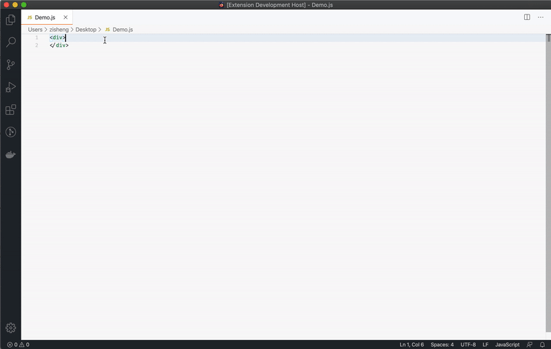
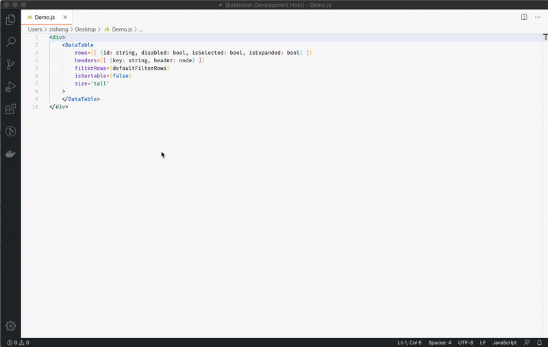
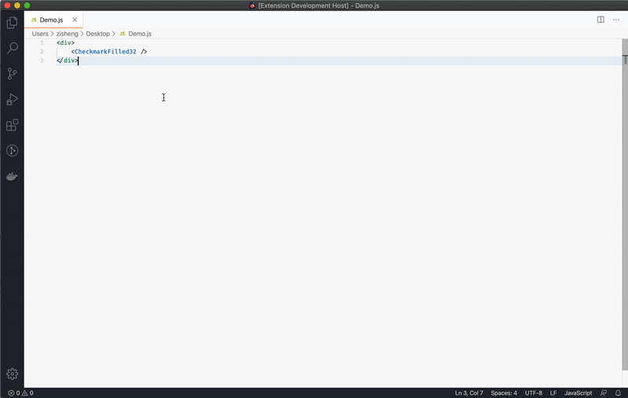

# IBM Carbon React Components Intellisense

This extension provides you Intellisense code completion and 
hints for [IBM Carbon Design System](https://www.carbondesignsystem.com/) React components and icons

## Features

1. Code Completion for Components, required props will be automatically inserted. Props will prompt values for selection 

2. Hover over components and their props for information.

3. Hover over icons and see preview

## Supported languages (file extensions)
- JavaScript (.js)
- JavaScript React (.jsx)

## Release Notes
### 1.0.0

Initial release of ...

-----------------------------------------------------------------------------------------------------------

**Enjoy!**
